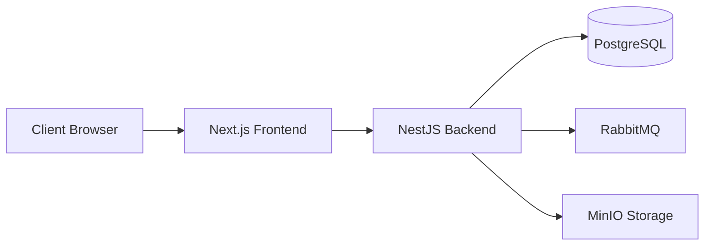

# 9events - Event Ticketing System

A modern, scalable event ticketing system built with microservices architecture, featuring a Next.js frontend and NestJS backend.

## 🎫 Repositories

### [tickets-webapp](https://github.com/9events/tickets-webapp)
Frontend application built with Next.js, featuring:
- QR code ticket generation and management
- Real-time ticket updates
- User management interface
- Administrative controls
- Material-UI components
- TypeScript support

### [tickets](https://github.com/9events/tickets)
Backend microservice built with NestJS, featuring:
- User authentication and authorization
- Ticket management system
- Role-based access control
- File uploads with MinIO
- Message queue with RabbitMQ
- PostgreSQL database

## 🚀 System Architecture



## 🛠 Tech Stack

### Frontend
- Next.js 14
- TypeScript
- Material-UI (MUI)
- QR Code Generation
- React Hooks
- React Hot Toast
- Jest & Playwright Testing

### Backend
- NestJS
- PostgreSQL
- RabbitMQ
- MinIO
- Docker
- Jest Testing

## 🏗 Getting Started

### Prerequisites
- Node.js 18+
- Docker and Docker Compose
- npm or yarn

### Development Setup

1. Clone both repositories:
```bash
git clone https://github.com/9events/tickets-webapp
git clone https://github.com/9events/tickets
```

2. Set up the backend:
```bash
cd tickets
cp .env.example .env
docker compose up --build
```

3. Set up the frontend:
```bash
cd tickets-webapp
npm install
cp .env.example .env
npm run dev
```

## 📝 Documentation

- Frontend API Documentation: `http://localhost:3000/api-docs`
- Backend API Documentation: `http://localhost:8080/api`
- RabbitMQ Management: `http://localhost:15672`
- MinIO Console: `http://localhost:9001`

## 🤝 Contributing

We welcome contributions to both repositories! Please check the individual repository's CONTRIBUTING.md files for guidelines.

## 📄 License

Both projects are MIT licensed - see the LICENSE files for details.

## 🙏 Acknowledgments

- Material-UI for the component library
- QRCode library for ticket generation
- Next.js team for the frontend framework
- NestJS team for the backend framework
- The open-source community

## 🔗 Links

- Organization: [9events](https://github.com/9events)
- Frontend Repository: [tickets-webapp](https://github.com/9events/tickets-webapp)
- Backend Repository: [tickets](https://github.com/9events/tickets)
