# 9events - Event Ticketing System

A modern, scalable event ticketing system built with microservices architecture, featuring a Next.js frontend and NestJS backend.

## 🎫 Repositories

### [tickets-webapp](https://github.com/9events/tickets-webapp)
Frontend application built with Next.js, featuring:
- QR code ticket generation and management
- Real-time ticket updates
- User management interface
- Administrative controls
- Material-UI components
- TypeScript support

### [tickets](https://github.com/9events/tickets)
Backend microservice built with NestJS, featuring:
- User authentication and authorization
- Ticket management system
- Role-based access control
- File uploads with MinIO
- Message queue with RabbitMQ
- PostgreSQL database

## 🚀 System Architecture

```mermaid
graph TD
    %% Styling
    classDef frontend fill:#ff9999,stroke:#cc0000,stroke-width:2px;
    classDef service fill:#99ff99,stroke:#00cc00,stroke-width:2px;
    classDef infrastructure fill:#9999ff,stroke:#0000cc,stroke-width:2px;
    classDef database fill:#ffff99,stroke:#cccc00,stroke-width:2px;

    %% Frontend Layer
    subgraph "Frontend Layer"
        webapp["🌐 Tickets Webapp<br/>(localhost:3000)"]
    end
    class webapp frontend

    %% Application Services Layer
    subgraph "Application Services"
        tickets["🎫 Tickets Service<br/>(localhost:8080)"]
        scanner["🔍 Scanner Service<br/>(localhost:8081)"]
        events["🎪 Events Service<br/>(localhost:8082)"]
        payments["💳 Payments Service<br/>(localhost:8083)"]
    end
    class tickets,scanner,events,payments service

    %% Infrastructure Layer
    subgraph "Infrastructure Services"
        rabbitmq["🐰 RabbitMQ<br/>(localhost:5672)"]
        rabbitmqUI["📊 RabbitMQ UI<br/>(localhost:15672)<br/>rabbit/password"]
        minio["📦 MinIO Console<br/>(localhost:9001)<br/>admin/password"]
    end
    class rabbitmq,rabbitmqUI,minio infrastructure

    %% Database Layer
    subgraph "Databases"
        tickets_db["💾 PostgreSQL - Tickets<br/>(localhost:5432)<br/>user/password"]
        scanner_db["💾 MongoDB - Scanner<br/>(localhost:27017)<br/>admin/password"]
        events_db["💾 PostgreSQL - Events<br/>(localhost:5433)<br/>user/password"]
        payments_db["💾 PostgreSQL - Payments<br/>(localhost:5434)<br/>user/password"]
    end
    class tickets_db,scanner_db,events_db,payments_db database

    %% Frontend Connections
    webapp --> tickets
    webapp --> scanner
    webapp --> events
    webapp --> payments

    %% Service to Message Queue
    tickets --> rabbitmq
    scanner --> rabbitmq
    events --> rabbitmq
    payments --> rabbitmq

    %% Service to Database
    tickets --> tickets_db
    scanner --> scanner_db
    events --> events_db
    payments --> payments_db

    %% Infrastructure Connections
    rabbitmqUI --> rabbitmq

    %% Connection Styling
    linkStyle default stroke-width:2px,fill:none,stroke:#666
```



## 🛠 Tech Stack

### Frontend
- Next.js 14
- TypeScript
- Material-UI (MUI)
- QR Code Generation
- React Hooks
- React Hot Toast
- Jest & Playwright Testing

### Backend
- NestJS
- PostgreSQL
- MongoDB
- RabbitMQ
- MinIO
- Docker
- Jest Testing

## 🏗 Getting Started

### Prerequisites
- Node.js 18+
- Docker and Docker Compose
- npm or yarn

### Development Setup

1. Clone the 9event repositories:
```bash
git clone https://github.com/9events/tickets-webapp
git clone https://github.com/9events/tickets
git clone https://github.com/9events/events
git clone https://github.com/9events/tickets-scanner
git clone https://github.com/9events/payments
```

2. Set up the backend:
Run the Tickets API
```bash
cd tickets
cp .env.example .env
npm i
npm run dev
```

Run the Tickets Scanner API and microservice
```bash
cd tickets-scanner
cp .env.example .env
npm i
npm run dev
```


Run the Events API and microservice
```bash
cd events
cp .env.example .env
npm i
npm run dev
```


Run the Payments Scanner API and microservice
```bash
cd Payments
cp .env.example .env
npm i
npm run dev
```

3. Set up the frontend:
```bash
cd tickets-webapp
npm install
cp .env.example .env
npm run dev
```

## 📝 Documentation

- Tickets API Documentation: `http://localhost:8080/api`
- Tickets Scanner API Documentation: `http://localhost:8081/api`
- Events API Documentation: `http://localhost:8082/api`
- Payments API Documentation: `http://localhost:8083/api`
- RabbitMQ Management: `http://localhost:15672`
- MinIO Console: `http://localhost:9001`

## 🤝 Contributing

We welcome contributions to both repositories! Please check the individual repository's CONTRIBUTING.md files for guidelines.

## 📄 License

Both projects are MIT licensed - see the LICENSE files for details.

## 🙏 Acknowledgments

- Material-UI for the component library
- QRCode library for ticket generation
- Next.js team for the frontend framework
- NestJS team for the backend framework
- The open-source community

## 🔗 Links

- Organization: [9events](https://github.com/9events)
- Frontend Repository: [tickets-webapp](https://github.com/9events/tickets-webapp)
- Backend Repository: [tickets](https://github.com/9events/tickets)

